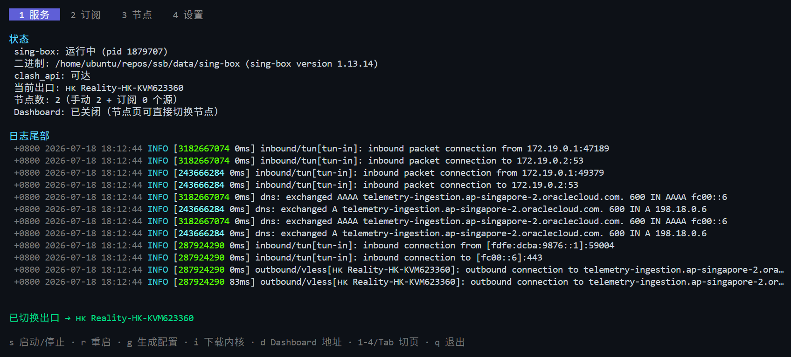
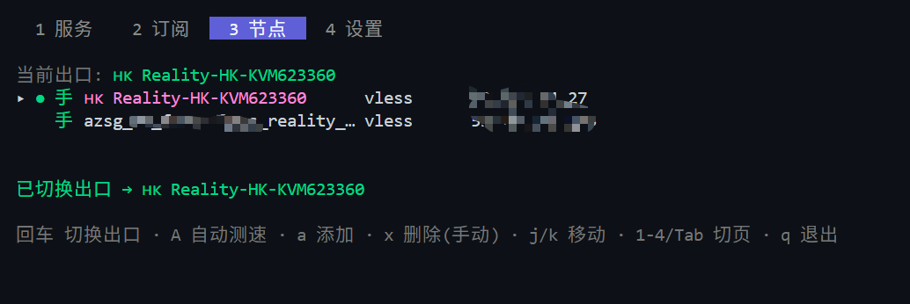
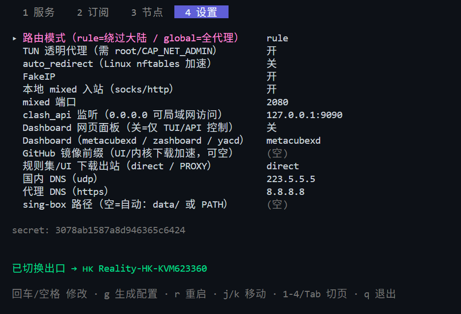

# ssb — 无桌面 Linux 的 sing-box 客户端管理器

单二进制 TUI/CLI 工具：把节点分享链接（`vless://`、`anytls://` 等）和订阅链接变成
sing-box 可直接运行的 `config.json`（默认 **TUN + FakeIP + 规则分流**），并托管
sing-box 进程。TUI 节点页直接切换出口；需要网页面板（clash_api +
metacubexd/zashboard/yacd）可在设置中开启（默认关闭）。

- **不污染系统**：所有东西（工具、sing-box 内核、配置、状态、日志）都在一个目录里，卸载 = 删目录
- 支持协议：VLESS（含 REALITY/Vision）、AnyTLS、Shadowsocks（含 2022）、VMess、Trojan、Hysteria2、TUIC
- 订阅三格式自动识别：sing-box JSON / base64 链接列表 / Clash YAML（自动按 UA 退避重试）
- 生成的配置**先过 `sing-box check` 再上线**，失败自动保留旧配置

## 快速开始（裸机，单目录）

从 [Releases](../../releases) 下载对应架构的包，两种任选：

- `ssb-<版本>-linux-<arch>-with-singbox.tar.gz` —— **完整包，自带 sing-box 内核，解压即用**
- `ssb-<版本>-linux-<arch>.tar.gz` —— 精简包，解压后先 `./ssb install` 下载内核（或自行复制到 `data/sing-box`）

```bash
mkdir -p ~/ssb && tar -xzf ssb-*-with-singbox.tar.gz -C ~/ssb && cd ~/ssb
./ssb add "vless://…" "anytls://…"      # 添加节点，或：
./ssb sub add https://example.com/sub 我的机场   # 添加订阅
./ssb doctor                  # 体检：TUN 权限 / 端口 / DNS
sudo ./ssb start              # TUN 需要 root；或先 sudo setcap cap_net_admin+ep data/sing-box 后免 sudo
./ssb dashboard               # 打印 Dashboard 地址（浏览器打开管理）
```

无参数运行 `./ssb` 进入 TUI（状态/订阅/节点/设置 四页签）。任何页面都能按
`s` 启停、`r` 重启、`?` 看全部按键；改过设置或增删节点后会自动重新生成配置，
服务在运行时顶栏会提示「按 r 重启生效」。

**推荐 `sudo ./ssb` 然后开启tun，体验最佳。**

不想用 TUN（免 root）：TUI 设置页关掉 TUN，走本地 mixed 端口
`socks5://127.0.0.1:2080`。

## 快速开始（Docker）

```bash
docker compose build
docker compose run --rm ssb add "vless://…"   # 或 sub add …
docker compose up -d                          # host 网络 + NET_ADMIN + /dev/net/tun
docker compose run --rm ssb dashboard
```

TUN 要接管宿主流量，容器必须 `network_mode: host` + `cap_add: NET_ADMIN` +
映射 `/dev/net/tun`（compose 已配好）。

## 截图

状态页——进程状态、当前出口与实时日志（j/k 翻看）：



节点页——回车直接切换出口，首行 auto 为自动测速（● 为当前出口，手=手动添加、订=来自订阅）：



设置页——按功能分组；开关/枚举回车轮转（退格反向），文本项回车编辑，底栏显示每项说明：



## 订阅自动更新（cron）

```cron
0 5 * * * cd ~/ssb && ./ssb sub update && sudo ./ssb restart
```

## Dashboard（可选）

**默认关闭**：日常切换出口在 TUI 节点页回车即可（选择由 cache_file 持久化，
重启不丢），clash_api 仅监听 127.0.0.1 供本机控制。

需要网页面板（测速、看连接、更细的策略组操作）时，在设置页打开
「Dashboard 网页面板」，按 r 重启——sing-box 首次启动会按
`external_ui_download_url` 自动把面板下载到 `data/ui/`（默认 metacubexd，
可换 zashboard / yacd；国内可配 GitHub 镜像前缀加速）。访问 `./ssb dashboard`
打印的地址；要在局域网其他设备访问，把 clash_api 监听改成
`0.0.0.0:9090`（secret 已默认随机生成）。

## 自定义分流（高级）

默认规则：**国内域名/IP（geosite-cn / geoip-cn）直连，其余走代理**。需要例外时，
在设置页「高级」组打开「自定义分流」，会多出两行：

- **强制代理域名**：例如 `openai.com`（自动含子域名）——即使命中国内规则也走代理
- **强制直连域名**：例如 `steamcdn.example.com` 或 `.edu.cn`（点开头=仅按后缀匹配）

逗号分隔多个域名，优先级高于内置规则，DNS 解析也会同步分流（直连域名用国内
DNS 拿真实 IP）。改完自动生成配置，按 r 重启生效。

## 日志

`logs/sing-box.log` 默认 `warn` 级别（连接级 INFO 噪音大、涨得快；排查问题时在
设置页临时调回 `info`/`debug`）。每次启动若日志超过 8MB 会轮转为
`sing-box.log.1`（只保留一份）。

## 权限说明（TUN）

TUN + auto_route 需要 `CAP_NET_ADMIN`，三选一：

1. `sudo ./ssb start`
2. 一次性：`sudo setcap cap_net_admin+ep data/sing-box`（只改本目录文件），之后免 sudo
3. 关闭 TUN 用 mixed 端口（免 root，但只代理显式走代理端口的应用）

## IPv6

设置页的「IPv6」默认 `auto`：生成配置时探测内核——先看 `/proc/net/if_inet6`，
再通过 netlink 试一次 AF_INET6 策略路由（RTM_GETRULE）。内核没有 IPv6，或者
有 IPv6 地址但不支持 IPv6 策略路由，都自动生成纯 IPv4 配置（TUN 不配 v6 地址、不开 `strict_route`、
FakeIP 不分配 v6、AAAA 查询直接返回空）。

如果启动报

```
FATAL start service: post-start inbound/tun[tun-in]: starting TUN interface:
      set rules: add rule 2/16: address family not supported by protocol
```

说明内核下不了 IPv6 策略路由（启动参数 `ipv6.disable=1`，或内核缺
`CONFIG_IPV6` / `CONFIG_IPV6_MULTIPLE_TABLES`——网卡上有 IPv6 地址也可能缺后者）。
设置为 `auto` 时重新 `./ssb gen` 即可自动降级；设置为 `on` 请改成 `off` 或 `auto`；
`./ssb doctor` 会指出属于哪一种。

## systemd-resolved 提示

Ubuntu 等系统 `/etc/resolv.conf` 指向 127.0.0.53（systemd-resolved 存根）。
TUN + `hijack-dns` 通常可以正常工作（resolved 的上游查询会进 TUN 被劫持）。
若遇到解析异常，可手动改 `/etc/systemd/resolved.conf`：`DNSStubListener=no`
并重启 resolved —— 本工具**不会**代改任何系统文件。

## 目录布局

```
~/ssb/
  ssb                   本工具
  data/sing-box         内核（./ssb install 或 TUI 状态页 i 下载；也可自行复制；PATH 里有也能用）
  data/config.json      生成的 sing-box 配置（.bak 为上一版）
  data/state.json       订阅/节点/设置（含 clash_api secret）
  data/ui/              Dashboard 静态文件
  data/cache.db         sing-box 缓存（FakeIP 持久化等）
  logs/ run/            日志与 pid
```

规则集（geosite-cn / geoip-cn）默认从 `testingcf.jsdelivr.net` CDN 下载
（MetaCubeX/meta-rules-dat 的 sing 分支），国内无需镜像即可直连。

## 开发

```bash
go build -o ssb ./cmd/ssb
go test ./...
```

生成逻辑锁定 sing-box 1.14.x 语法（新版 DNS server 格式、route actions、rule-set +
http_clients）；任何生成结果都会先 `sing-box check`，与本机内核版本不符会在生成时
立刻报错。内核若对配置有弃用告警，`gen` / `doctor` 也会一并提示。

## 许可

ssb 本身以 [MIT License](LICENSE) 开源。

Release 中的 `-with-singbox` 完整包额外附带了未经修改的
[sing-box](https://github.com/SagerNet/sing-box) 官方二进制（仅打包在一起分发，
不构成衍生作品），sing-box 版权归 SagerNet 所有，遵循
[GPL-3.0（含附加条款）](https://github.com/SagerNet/sing-box/blob/dev-next/LICENSE)，
其源码见上述仓库；附带的内核版本号在 Release 说明与
`.github/workflows/release.yml` 的 `SINGBOX_VERSION` 中注明。
